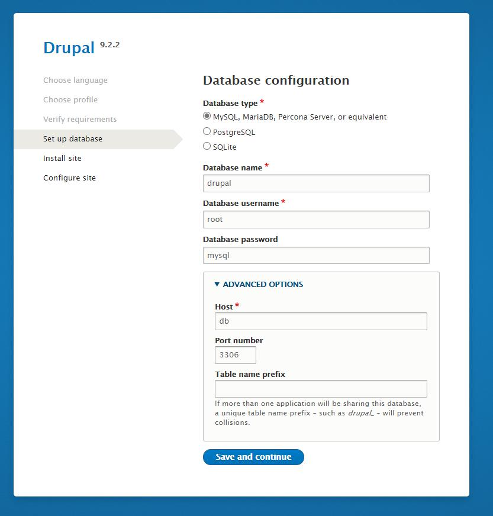

[](https://opensource.org/licenses/MIT)

# Drupal development environment <!-- omit in toc -->

- [Initial download](#initial-download)
- [Usage](#usage)
  - [Standalone (docker-compose)](#standalone-docker-compose)
- [Getting started](#getting-started)
- [Database setup](#database-setup)
- [Useful commands](#useful-commands)
  - [Database](#database)
- [Notes](#notes)
  - [Docker for Windows using WSL2](#docker-for-windows-using-wsl2)
- [Environment Variables](#environment-variables)
- [Authors](#authors)


A quick Drupal environment with MySQL and PHPMyAdmin for easy development.

## Initial download

Clone this git repository in a location of your choosing. (e.g. `~/dev/`)

```bash
$ git clone https://github.com/QNimbus/docker-dev-drupal
```

## Usage

### Standalone (docker-compose)

To start the Docker stack using `docker-compose`:

```bash
# To start in background (use --detach or -d)
$ docker-compose up --detach 

# To start in foreground
$ docker-compose up
```

To stop the Docker stack using `docker-compose`:

```bash
# To stop
$ docker-compose down
```

To view log output of the running containers:

```bash
# Last 10 lines of running containers
$ docker-compose logs --tail=10

# Continuous log output of running containers
$ docker-compose logs --tail=10 --follow

# Continuous log output of specific container, e.g. 'drupal'
$ docker-compose logs --tail=10 --follow drupal
```

## Getting started

After starting de Docker stack using the `docker-compose` command from the [usage](#usage) section you will have 3 Docker containers running. You can view the running containers by running:

```bash
# Using docker-compose
$ docker-compose ps

# Alternatively, using docker
$ docker ps -f "name=drupal"
```

You will see something like this:

```bash
      Name                     Command               State                                   Ports
-----------------------------------------------------------------------------------------------------------------------------------
drupal              docker-php-entrypoint apac ...   Up      0.0.0.0:443->443/tcp,:::443->443/tcp, 0.0.0.0:80->80/tcp,:::80->80/tcp
drupal_mysql        docker-entrypoint.sh mysqld      Up      3306/tcp, 33060/tcp
drupal_phpmyadmin   /docker-entrypoint.sh apac ...   Up      0.0.0.0:8080->80/tcp,:::8080->80/tcp
```

This means you can point your browser to [localhost](http://localhost:80) and you should see your Drupal instance. When you do this for the first time you will need to perform some basic configuration for Drupal. (e.g. database connection settings, admin user, et cetera)

In the second setup section you need to enter the database connection settings. For the database host name you need to use `db` since that is the hostname of the Docker MySQL container. The username and password for the MySQL instance are `root` and `mysql` (see: [docker-compose.yaml](docker-compose.yaml))

## Database setup

During the Drupal installation wizard, enter the following to connect to the MySQL database:

```
Database name: drupal
Database username: root
Database password: mysql

## Advanced options ##

Host: db
Port number: 3306
```



## Useful commands

### Database

To dump Drupal database to a file:

```bash
$ docker exec drupal_mysql mysqldump --user root --password=mysql --databases drupal --add-drop-database > drupal.db.sql

# Note: when using Git Bash on Windows use the command below:
$ docker exec drupal_mysql //bin/bash -c "mysqldump --user root --password=mysql --databases drupal --add-drop-database > drupal.db.sql"
```

To import Joomla database from a file:

```bash
$ docker exec -i drupal_mysql mysql --user root --password=mysql < drupal.db.sql

# Note: when using Git Bash on Windows use the command below:
$ docker exec -i drupal_mysql //bin/bash -c "mysql --user root --password=mysql < drupal.db.sql"
```

## Notes

### Docker for Windows using WSL2

See: [Docker Desktop WSL 2 backend - Best practices](https://docs.docker.com/docker-for-windows/wsl/#best-practices)

To get the best out of the file system performance when bind-mounting files, we recommend storing source code and other data that is bind-mounted into Linux containers (i.e., with `docker run -v <host-path>:<container-path>`) in the Linux file system, rather than the Windows file system. You can also refer to the [recommendation](https://docs.microsoft.com/en-us/windows/wsl/compare-versions) from Microsoft.


## Environment Variables

| Variable       | Required? | Default | Description                                 | More info                                                         |
| :------------- | :-------: | :-----: | :------------------------------------------ | :---------------------------------------------------------------- |
| DRUPAL_VERSION |    NO     |    9    | Specify Drupal docker container version tag | [Docker container tags](https://hub.docker.com/_/drupal?tab=tags) |
| MYSQL_VERSION  |    NO     |   5.7   | Specify MySQL docker container version tag  | [Docker container tags](https://hub.docker.com/_/mysql?tab=tags)  |

Environment variables can be passed via the command line, e.g.:

```bash
$ DRUPAL_VERSION=7 docker-compose up --detach
```

Or by specifying them in the `.env` file, e.g.:

```bash
# .env
DRUPAL_VERSION=7
```
  
## Authors

- [@qnimbus](https://www.github.com/qnimbus)
